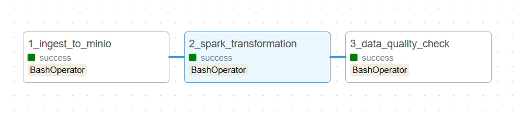

# 🚖 NYC Taxi Data Pipeline: End-to-End Automated Orchestration


A production-grade, containerized **Data Engineering pipeline** designed to ingest, process, and validate high-volume NYC Taxi trip data.

This project demonstrates **Modern Data Stack (MDS)** best practices by implementing a robust ETL workflow. It leverages **Apache Spark** for distributed processing and **Airflow** for orchestration, ensuring data flows seamlessly from a raw Data Lake (MinIO) to a structured Data Warehouse (PostgreSQL) with strict quality guardrails.

---

## 📊 Data Scale & Performance Highlights

This pipeline is engineered to handle significant data workloads, demonstrating the efficiency of **Spark Distributed Computing**:

* **Dataset Source:** NYC Yellow Taxi Trip Records (January 2024).
* **Total Data Volume:** Processed over **2.96 Million raw records** in a single run.
* **Transformation Logic:** High-speed data cleaning (filtering invalid trips), temporal feature engineering, and complex financial metric aggregations.
* **Performance:** Leveraged a **Spark Master-Worker cluster architecture** to execute transformations in parallel, significantly reducing processing latency compared to traditional single-node Pandas execution.
---

## 🏗️ System Architecture

The pipeline implements a **Lakehouse-style architecture** to ensure scalability and data integrity:

1.  **Ingestion Layer (Data Lake):** Automatic extraction of raw Parquet files from the source to **MinIO** (S3-compatible object storage).
2.  **Processing Layer (Distributed Compute):** **Apache Spark** performs heavy-lifting transformations, cleaning, and aggregation on the cluster.
3.  **Serving Layer (Data Warehouse):** Processed insights are loaded into **PostgreSQL** for downstream analytics and BI consumption.
4.  **Quality Layer (Governance):** Automated validation using **Great Expectations** ensures no bad data enters the warehouse.

<p align="center">
  
  <br>
  <em>Figure 1: The Directed Acyclic Graph (DAG) visualizing the dependency chain.</em>
</p>

---

## 🚀 Key Engineering Features

- **Distributed Data Processing:** Utilizes **Spark Cluster (Master-Worker architecture)** to handle large-scale datasets efficiently, decoupling compute from storage.
- **Container-First Infrastructure:** Fully containerized environment using **Docker Compose**, ensuring reproducibility across any OS (Linux/WSL2/macOS).
- **Defensive Data Engineering:** Implements a **Hybrid Quality Check** system. It uses _Great Expectations_ for standard validation and a custom Python fallback mechanism to guarantee pipeline reliability.
- **Infrastructure as Code (IaC):** The entire stack (including network, volumes, and service dependencies) is defined in code, allowing for one-command deployment.

---

## 📁 Repository Structure

```text
nyc-taxi-pipeline/
├── assets/
│   ├── airflow_graph.png
│   └── data_result.png
├── dags/                  # Airflow DAGs (Orchestration Logic)
│   └── nyc_taxi_dag.py
├── scripts/               # Python Scripts (ELT Modules)
│   ├── ingest_to_minio.py      # S3/MinIO Ingestion
│   └── data_quality_check.py   # Great Expectations Validation
├── spark/                 # Spark Applications
│   └── apps/
│       └── transform_taxi_data.py # PySpark Transformation Logic
├── Dockerfile             # Custom Airflow Image with Spark Clients
├── docker-compose.yml     # Infrastructure Orchestration (Airflow, Spark, MinIO, Postgres)
├── requirements.txt       # Python Dependencies
└── README.md              # Project Documentation

```

---

## 🛠️ Quick Start Guide

Follow these steps to deploy the data engineering pipeline locally:

### 1. Clone the Repository

```bash
git clone https://github.com/KMoex-HZ/nyc-taxi-pipeline-spark-airflow.git
cd nyc-taxi-pipeline

```

### 2. Spin Up Infrastructure

Launch the entire stack (Airflow, Spark, MinIO, Postgres) in detached mode.

```bash
docker-compose up -d --build

```

_Wait for a few minutes for the Airflow Webserver to initialize._

### 3. Access the Dashboards

- **Airflow UI:** `http://localhost:8080` (User: `admin` / Pass: `admin`)
- **Spark Master UI:** `http://localhost:8081`
- **MinIO Console:** `http://localhost:9001`

### 4. Trigger the Pipeline

1. Go to the Airflow UI.
2. Unpause the `nyc_taxi_data_pipeline_v_final` DAG.
3. Trigger the DAG manually or wait for the schedule.

<p align="center">
  
  <br>
  <em>Figure 2: Sample output showing aggregated trip metrics in PostgreSQL.</em>
</p>

---

## 🔮 Future Improvements

- **CI/CD Integration:** Implement **GitHub Actions** to automate linting (Ruff/Flake8) and testing on every pull request.
- **Cloud Migration:** Refactor the infrastructure to run on **AWS EMR** (Spark) and **Amazon S3** for production scalability.
- **Dashboarding:** Connect **Metabase** or **Superset** to PostgreSQL for real-time visualization of taxi revenue trends.

---

**Author:** [Caelan Zhou](https://github.com/KMoex-HZ)

**Education:** Data Science, Institut Teknologi Sumatera (ITERA)

**License:** MIT License
